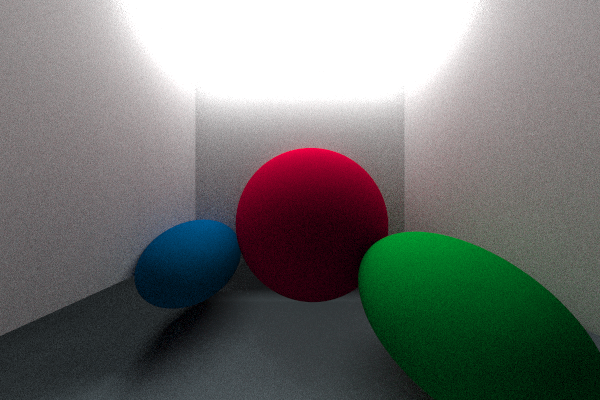

# ElRey

`ElRey` is a Ray tracer made using the SDL library and C++.

Created after reading the following books:
1. *Ray Tracing in One Weekend* series by Peter Shirley.
2. *Ray Tracing from the Group Up* by Kevin Suffern.
3. And so on....

You will need `cmake` or `cmake-gui` to prepare the platform-dependent files to build the `ElRey`. The program needs to run from the build folder so that the asset paths resolve correctly (for now). 
